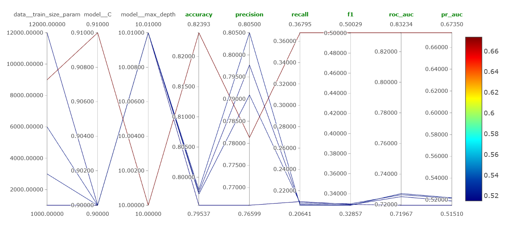
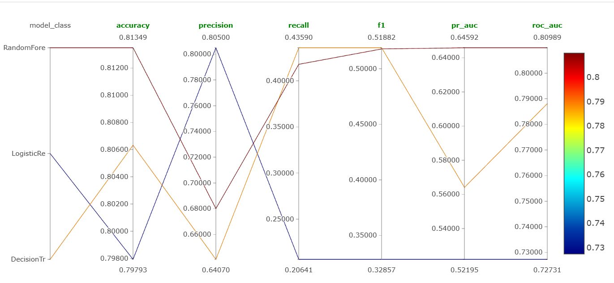
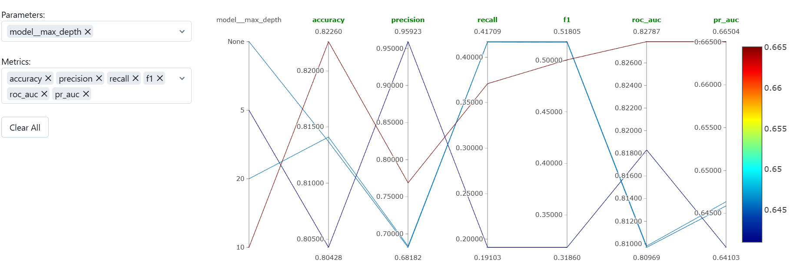

# Отчет

## Разрез A: влияние размера train на качество в Logreg

Гипотеза: увеличение размера тренировочного датасета улучшает качество модели

Параметр: размер тренировочного датасета

Сетка значений: 1000 - 3000 - 6000 - 9000 - 12000

Выводы: видно, что с ростом размера датасета есть рост в accuracy,precision, roc-auc, pr-auc, в recall , f1 изменение метрики очень маленькое. При этом  для большинства метрик максимум достигается при размере 9000, а не 12000, поэтому можно сделать вывод, что увеличение размера не гарантирует увеличение метрик

Лучший запуск по ROC-AUC: http://158.160.2.37:5000/#/experiments/18/runs/1de72464026d4d199074529e8635c94f

## Разрез B: разные модели

Гипотеза: более гибкие модели (деревья/ансамбли) дадут более высокие метрики по сравнению с Logistic Regression, так как могут моделировать нелинейные зависимости

Параметр: модель

Значения: logreg,dtree,rf

Выводы: видно, что во всех метриках кроме precision модели на основе деревьев лучше логрега, также видно что случайный лес намного лучше решающего дерева по roc-auc,pr-auc,accuracy. то есть гипотеза подтвердилась

лучший запуск по ROC-AUC: http://158.160.2.37:5000/#/experiments/18/runs/3066ba69865740dab7d88c58c0364acc

## Разрез C: разная глубина для дерева в RF

Гипотеза: при изменении max_depth у RF качество на тесте будет максимальным при некоторой умеренной глубине

Параметр: max_depth

Сетка значений: None,5,10,20

Выводы: видно что по метрикам выигрывает глубина 10, это и есть умеренная величина для ограничения глубины, чтобы деревья не переобучались

лучший запуск по ROC-AUC: http://158.160.2.37:5000/#/experiments/18/runs/a7a80ef55c124dc8b08826f837bdf663