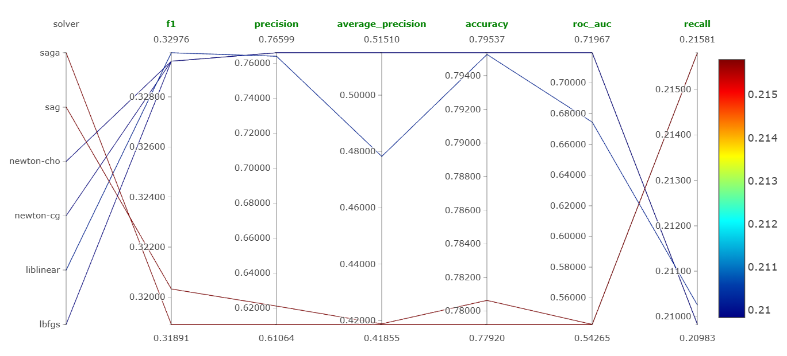
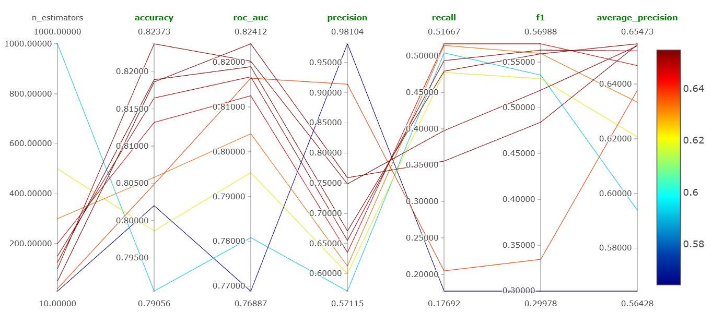
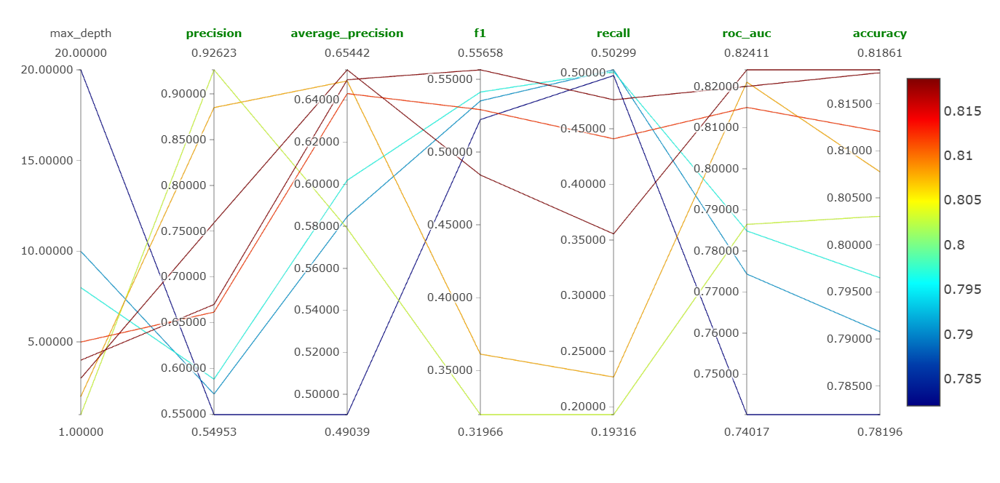
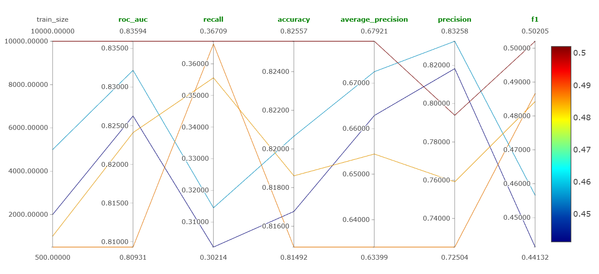

## 1 эксперимент: выбор solver в логрег

Гипотеза: выбор solver может заметно влиять на качество, потому что разные оптимизаторы по‑разному сходятся

Параметр: solver

Значения: saga,sag,newton-cho,newton-cg,liblinear,lbfgs

Выводы: солверы saga,sag показали себя хуже всего, а остальные заметно не отличаются по качеству

Лучший запуск по ROC-AUC: http://158.160.2.37:5000/#/experiments/13/runs/92439cca7d0c46559421092278226b35

## 2 эксп: выбор n_estimator в GB

Гипотеза: при увеличении числа деревьев n_estimators качество на тесте сначала растёт, а затем выходит на плато или ухудшается из‑за переобучения; поэтому ожидается оптимум при некотором промежуточном значении n_estimators.

Параметр: n_estimator

Сетка значений: 10,20,50,100,125,150,200,300,500,1000

Вывод: гипотеза подтвердилась , сначала с ростом n_estimators качество растет и до 200 метрики примерно одинаковые и достигают там максимума, а начиная с 300 уже заметное ухудшение

Лучший запуск по ROC-AUC: http://158.160.2.37:5000/#/experiments/13/runs/9c654271daa64bfc8be4b1b861c1a8b7

## 3 эксп: выбор max_depth для GB

Гипотеза:  при увеличении max_depth качество на тесте сначала улучшается, но при слишком большой глубине ухудшается из‑за переобучения, поэтому оптимум ожидается при некоторой умеренной глубине

Параметр: max_depth

Сетка значений: 1,2,3,4,5,8,10,20

Вывод: гипотеза подтвердилась, для большой глубины заметное ухушдение, идеальный баланс метрик - глубина около 5

Лучший запуск по ROC-AUC: http://158.160.2.37:5000/#/experiments/13/runs/22f7c559a7e2430681b2f203c3b213cf

## 4 эксп: выбор train_size

Гипотеза: при увеличении train_size модель будет лучше

Параметр: train_size

Сетка значений: 500,1000,2000,5000,10000

Вывод: гипотеза подтвердилась, при наибольшем размере датасете метрики наибольшие

Лучший запуск по ROC-AUC: http://158.160.2.37:5000/#/experiments/13/runs/97e8b1d90e144441b248bf13710d6661